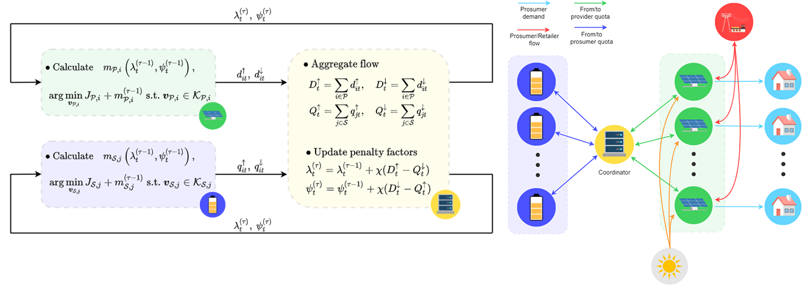
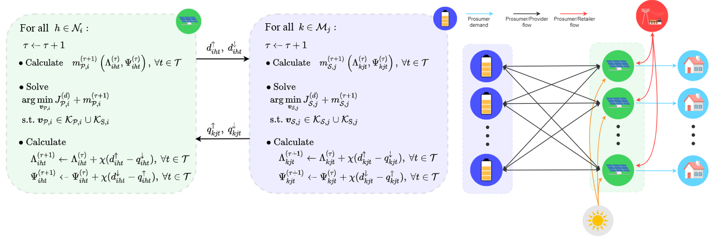

# Multiple storage systems in smart grids
This repo contains the MATLAB code used in the MSc thesis _"Control techniques for multiple energy storage systems in smart grids"_.

The main idea is to consider the energy storage as a service provided by an independent economical agents, i.e., the _providers_. _Prosumers_ can than decide whether to sell the exceeding energy to the _retailer_ or store it. 

  </img>

## Prosumer and provider models
The model for the </img> prosumer comprises the cost function </img>, i.e.,

subject to the constraints set 

 

where </img> is the energy generated by the </img> prosumer, </img> is its demand, </img> is the energy retrieved from providers' storage systems, while </img> is the energy transferred to providers. The amount of energy bought from the provider is </img>, while the amount sold is </img>. The amount of energy stored is </img>. Vector </img> contains the previously listed variables. Parameters </img>, </img>, </img> are, respectively, the energy buying and selling prices, and the storage service price.

As for the model for the </img> provider, it comprises the cost function </img>, i.e.,

subject to the constraints set

 

where </img> is the energy received by prosumers, </img> is the energy retrieved by prosumers, </img> is the storage system charging level. Vector </img> contains the previously listed variables. The degradation rate is 
.  

## Implementative approaches
### Centralized
The centralized approach consists of a grand coalition resulting from the union of the prosumers' and providers' communities. A _community manager_ solves the ooptimization problem on behalf of all agents. 

  </img>

The objective function is </img> results from the sum of the objective functions of all agents, i.e.,

  </img>

subject to 

  </img>

where </img> is

  

This approach returns an optimal and paretian solution for the coalition, but is not practically conveneient to realize. Therefore, the decentralized and distributed approaches are formulated as alternatives.

### Decentralized
In the decentralized approach the problem is formulated as a non-cooperative game where its solution corresponds to a Nash equilibrium point. The iterative algorithm consists of every agent solves its optimization problem and then communicates the state of its energy flow variables to a _coordinator_. Therefore, the latter can calculate the aggregate energy flow values and, consequently, the penalty factors </img> and </img>, which guarantee the convergence of the energy flow constraints. Penalty factors are, then, are boradcasted to all agents, in order for them to calculate the penalty regularizers </img> and </img>, which are added to the objective function.

  </img> 

### Distributed
In the distributed approach, the communication and energy transfer network is modelled as a bipartite graph. Each agent solves its own optimization problem and broadcasts the state of its energy flow variables to the nodes in its neighborhood. Therefore, penalty factors and regularizers are autonomously updated, without the need of a coordinator.

  </img>

